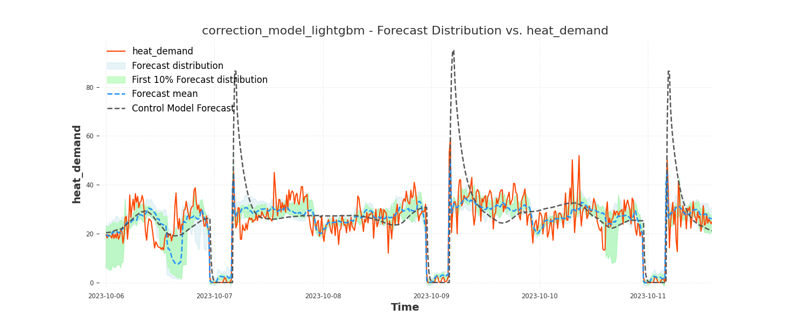

# AMP: Automated Modelling Pipeline


AMP (**Automated Modelling Pipeline**) simplifies and accelerates the creation of accurate forecasting models for building energy systems by automating key steps in the modeling process. It is designed for researchers, developers, and analysts.




## Table of Contents  
- [Developers](#developers)  
- [Features](#features)  
- [Installation](#installation)  
  - [Option 1: Contributors](#option-1-contributors)
  - [System Requirements](#system-requirements)  
- [Quickstart Forecasting Example](#quickstart-forecasting-example)  
- [Usage](#usage)  
  - [1. Dataset Creation](#1-dataset-creation)  
  - [2. Feature Selection](#2-feature-selection)  
  - [3. Defining Targets](#3-defining-targets)  
  - [4. Model Selection and Tuning](#4-model-selection-and-tuning)  
  - [5. Model Training and Evaluation](#5-model-training-and-evaluation)  
    - [Walk-forward Validation](#walk-forward-validation)
- [Baselines](#baselines)
- [Making Predictions with AMP Models Online](#making-predictions-with-amp-models-online)
- [MLflow Integration with AMP](#mlflow-integration-with-amp)
- [Interactive Forecast Viewer](#interactive-forecast-viewer)
- [Examples](#examples)  
- [Creating Your Own AMP Project](#creating-your-own-amp-project)  
- [License](#license)

## Developers

- Jussi Kiljander
- Janne Takalo-Mattila
- Juho Kivelä

## Features

- Automatic training and evaluation of forecasting models.
- Supports customizable hyperparameter tuning with grid or random search.
- Pre-built templates for creating energy forecasters quickly.
- Extendable framework for adding custom models and workflows.

## Installation

### Option 1: Contributors

1. **Clone the repository:**

    ```bash
    git clone https://github.com/vttresearch/automated_modelling_pipeline.git
    ```

2. **Create an environment (recommended: Conda):**

    ```bash
    conda create --name amp python=3.11.13
    ```

3. **Activate the environment:**

    ```bash
    conda activate amp
    ```

4. **Install the package and requirements:**

    - **Core packages only:**

        ```bash
        pip install -e .
        ```

    - **With extras (e.g., TensorFlow, Darts and mlflow support):**

        ```bash
        pip install -e ."[darts,tensorflow, mlflow]"
        ```

### System Requirements

- **Operating System:** Linux, macOS, or Windows
- **Python Version:** 3.11+
- **Recommended Tools:** Conda, PyCharm

---

## Quickstart Forecasting example
This section provides a step-by-step guide to quickly train and evaluate a forecasting model using this package. Use a dataset from /examples/hoas/data/hoas_example_data.csv. Below is a complete example of training and evaluating a LightGBM-based forecaster with baseline models.

```python
import pandas as pd
import pathlib
from amp.base import Target
from amp.preprocessing import basic_features
from amp.efp.models.lightgbm import LightGBMForecaster
from amp.tools import train_eval_tool
from amp.baselines import MeanBaseline, LagBaseline

# Define parameters
data_freq = 60  # Data frequency in minutes
forecast_len = 24  # Forecast length (steps)
lead_time = 0  # Forecasting from the current time
update_freq = 1  # Update frequency
test_period = ('2020-01-01', '2020-03-30')

# Load dataset
df = pd.read_csv(pathlib.Path('data/hoas_example_data.csv'), index_col='timestamp', parse_dates=True)

# Define forecasting targets
targets = [Target(output='dh'), Target(output='ele')]

# Define features
features = basic_features(lead_time=lead_time,
                          forecast_len=forecast_len,
                          features=['lagged_target', 'weekday', 'hour', 'month', 't_out', 'holiday'],
                          target_lags=[24 * 7],
                          target_lag_len=24 * 7,
                          temp_lag=8)

# Create a LightGBM forecaster
model_dict = {'lightgbm_forecaster': LightGBMForecaster(targets=targets,
                                                        lead_time=lead_time,
                                                        forecast_len=forecast_len,
                                                        data_freq=data_freq,
                                                        features=features,
                                                        update_freq=update_freq)}

# Create baseline models for comparison
baselines = {'mean': MeanBaseline(),
             'lag_4': LagBaseline(4),
             'lag_24': LagBaseline(24)}

# Train the model
train_eval_tool(mode='fit',
                targets=targets,
                models=model_dict,
                df=df,
                test_period=test_period,
                data_freq=data_freq,
                fcast_len=forecast_len,
                lead_time=lead_time,
                update_rate=update_freq,
                baselines=baselines)

# Evaluate the model
train_eval_tool(mode='eval',
                targets=targets,
                models=model_dict,
                df=df,
                test_period=test_period,
                data_freq=data_freq,
                fcast_len=forecast_len,
                lead_time=lead_time,
                update_rate=update_freq,
                baselines=baselines,
                plot='best')
```


## Usage

Typical phases of AMP project are:
1. Dataset creation
2. Feature selection 
3. Defining targets 
4. Model selection and tuning 
5. Fitting and model evaluation

### 1. Dataset creation

AMP is designed to work with time-series datasets, particularly those related to building energy systems.

### **Dataset Format**
AMP expects CSV files with timestamps and relevant feature columns. Below is an example dataset:

```csv
timestamp,ele,dh,t_out
2015-01-01 00:00:00,5.0,70.0,4.05
2015-01-01 01:00:00,5.0,70.0,4.033333333333333
2015-01-01 02:00:00,5.0,70.0,4.1000000000000005
2015-01-01 03:00:00,5.0,70.0,3.966666666666667
2015-01-01 04:00:00,5.0,80.0,3.2999999999999994
2015-01-01 05:00:00,5.0,70.0,3.516666666666667
...
```
### **Column Descriptions**
- **`timestamp`**: The datetime of the observation (must be in a consistent format).
- **`ele`**: The target variable representing electricity consumption.
- **`dh`**: The target variable representing district heating consumption
- **`t_out`**: Outdoor temperature (feature).

### **Loading a Dataset in AMP**
You can load datasets in AMP using Pandas:

```python
import pandas as pd
import pathlib

filepath = pathlib.Path('data/files/dataset.csv')
df =  pd.read_csv(filepath, index_col='timestamp', parse_dates=True)
```

### **Division of data into training, validation and testing sets**
By default the imported data can be divided into training and validation sets by defining the test_period.
```python
test_period = ('2015-02-01 00:00:00', '2015-02-10 00:00:00')
```

In case you want to define multiple periods for training, validation and testing, it can be done by leaving the **test_period** argument as an empty tuple, and instead defining an optional argument **data_periods**. In case you opt to use **data_periods** argument, you need to take into account the following:
- Your models fit-function needs to support the following format: fit(training_dataset, validation_dataset). You may leave **validation_dataset** empty if your model fitting does not support it. 
- The data for fit and predict functions is no longer a dataframe, but a list of dataframes. 
```python
test_period = ()
data_periods = dict(
    training=[('2015-01-01 00:00:00', '2015-02-01 00:00:00'), ('2015-02-10 00:00:00', '2015-03-01 00:00:00')],
    validation=[],
    testing=[('2015-02-01 00:00:00', '2015-02-03 00:00:00'), ('2015-02-06 00:00:00', '2015-02-10 00:00:00')]
)
```

### 2. Feature selection

Features are defined using a dictionary where keys are feature names and values are dictionaries specifying the feature properties. Each feature dictionary contains:
```python
'name_of_the_feature': {'windows': [(-8, 23)], 'type': 'numeric'}

```
The `windows` parameter defines the time range for the feature relative to the forecast start time. For example, `(-8, 23)` means the feature includes data from 8 hours before the forecast start to 23 hours into the forecast horizon.
AMP supports the following types for features: `'numeric'`, `'onehot'`, and `'cyclical'`


__Using the basic_features Method__

AMP provides a helper method called `basic_features` that can be used to generate commonly used features for time-series forecasters. It is defined as follows:

```python
def basic_features(lead_time,
                   forecast_len,
                   features=['lagged_target', 'weekday', 'hour', 'month'],
                   target_lags=[7*24, 24],
                   target_lag_len=1,
                   temp_lag=0):
```

The basic_features function is a tool in AMP, designed to create feature configurations for time series forecasting. It helps in generating key temporal, categorical, and lagged features, making it easier to prepare data for forecasting models.

* lead_time: Specifies the time gap between the current data point and the start of the forecast period. Used to align features with the prediction horizon.

* forecast_len: Defines how long the forecast extends into the future

* features (possible options: ['lagged_target', 'weekday', 'hour', 'holiday', 'month', 't_out']): A list specifying the features to include in the output.

* target_lags (default: [7 * 24, 24]): Specifies time intervals (in hours) for lagged values of the target variable.	For example, [7*24, 24] uses data from one week ago and one day ago.

* target_lag_len (default: 1): The number of consecutive past values to include for each lag window.

* temp_lag (default: 0): Allows an offset for temperature data. For example, if temperature influences the target with a delay, this value adjusts accordingly.


_basic_features_ method returns a dictionary that can be used as a input for the forecaster. Following is an example dictionary generated by the method:
```python
{'lagged_target': {'windows': [(-168, -1)], 'type': 'numeric'},
 'weekday': {'windows': [(0, 23)], 'type': 'cyclical'},
 'hour': {'windows': [(0, 23)], 'type': 'cyclical'},
  'month': {'windows': [(0, 23)], 'type': 'cyclical'}
 't_out': {'windows': [(-8, 23)], 'type': 'numeric'},
 'holiday': {'windows': [(0, 23)], 'type': 'onehot'}}
```
* **lagged_target**: Uses past values of the target variable (e.g., energy usage) from 168 hours (7 days) ago to 1 hour ago to capture historical patterns.
* **weekday**: Cyclically encodes the day of the week for each time step in the forecast horizon (0–23 hours) to capture weekly trends.
* **hour**: Cyclically encodes the hour of the day for each time step (0–23) to capture daily patterns.
* **month**: Cyclically encodes the month of the year for each time step (0–23) to capture yearly patterns.
* **t_out**: Includes temperature data from 8 hours before the forecast starts to 23 hours into the horizon as a numeric feature to capture weather effects.
* **holiday**: Flags holidays using a one-hot encoding for the forecast horizon (0–23), accounting for deviations from normal patterns.

__Manually Defining Features__

The dictionary created by `basic_features` can be extended or replaced by manually defining features. For example, if the training dataset contains a column `LS1_power` and it needs to be used as a feature, it can be defined as follows:
```python
features = {}
ls1 = {'windows': [(lead_time, lead_time + forecast_len - 1)],
                           'type': 'numeric'}
features['LS1_power'] = ls1
```
Another way is to extend the dictionary created by basic features:

```python
features = basic_features(lead_time=lead_time,
                          forecast_len=forecast_len,
                          features=['lagged_target'],
                          target_lags=[24],
                          target_lag_len=24)


ls1 = {'windows': [(lead_time, lead_time + forecast_len - 1)],
                           'type': 'numeric'}
features['LS1_power'] = ls1
```

The example below shows a feature dictionary where historical target values, weekday, hour, holiday, month, and multiple outdoor temperature measurements are used. In this example, we utilize both historical values and values that are known in advance for the forecast period. Outdoor temperatures (`t_out1`, `t_out2`, `t_out3`, `t_out4` must be found in the dataset columns) use both historical values (8 hours) and 24 hours of future values. For the lagged target, we use a 24-hour window starting from one week ago (-168h to -145h) and 24 hours of recent measurements (-24 to -1). In this example, we assume 1-hour data frequency.
```python
features = {
    "lagged_target": {"windows": [(-168, -145), (-24, -1)], "type": "numeric"},
    "weekday": {"windows": [(0, 23)], "type": "cyclical"},
    "hour": {"windows": [(0, 23)], "type": "cyclical"},
    "month": {"windows": [(0, 23)], "type": "cyclical"},
    "t_out1": {"windows": [(-8, 23)], "type": "numeric"},
    "t_out2": {"windows": [(-8, 23)], "type": "numeric"},
    "t_out3": {"windows": [(-8, 23)], "type": "numeric"},
    "t_out4": {"windows": [(-8, 23)], "type": "numeric"},
    "holiday": {"windows": [(0, 23)], "type": "onehot"},
}
```


### 3. Defining targets
Targets are defined using instances of the Target class. Each target is an object that encapsulates the properties of a forecasting target, such as the output name, column from the dataset, plot label, and optional evaluation scaler.

Here’s how you would define a target using the Target class:
```python
targets = Target(output='dh', 
                eval_column='dh', 
                plot_label='dh_measured')
```

* output: This defines what the model will predict and how the predictions will be referenced.
* eval_column: This is the column in the dataset that contains the historical data for training the model.
* plot_label: This is a descriptive name used when visualizing the results (e.g., in plots or graphs).
* eval_scaler: This optional parameter defines the weight assigned to the output during evaluation (if eval_scaler is 0, the target is not used in model evaluation).

Forecaster class and train_eval_tool expects list of Targets as a input. It can be defined as following:
```python
targets = [
    Target(output='dh'),
    Target(output='ele', eval_column='ele', plot_label='ele_measured', eval_scaler=10)
]
```

Currently, each Forecaster for target _X_ is trained using the same feature combination.


### 4. Model Selection and Tuning

AMP supports various ML models such as LightGBM, MLP, and Random Forest. A model is defined as follows: 

```python
forecasters = {'lgbforecaster': LightGBMForecaster(targets,
                                             lead_time,
                                             forecast_len,
                                             data_freq,
                                             features=features,
                                             update_freq=update_freq,
                                             verbose=3)
```
features and output are explained in the sections _Feature selection_ and  _Defining targets_

Instead of using default hyperparameters, users can set custom hyperparameters for forecaster models using the `hyperparams` parameter as follows:
```python
 LightGBMForecaster(targets,
                    lead_time,
                    forecast_len,
                    data_freq,
                    features=features,
                    update_freq=update_freq,
                    verbose=3,
                    hyperparams={'max_depth': 16}
```


You can also define your custom search space and method in Python. The `hyperparam_search` parameter can be used to specify the hyperparameter search space and method:

```python
param_search_base_lightgbm = {
    'num_leaves': [7, 14, 21]
}
hyperparam_search_lightgbm = {
    'hyperparam_space': param_search_base_lightgbm,
    'hyperparam_search_method': 'grid_search',
}
LightGBMForecaster(targets,
                   lead_time,
                   forecast_len,
                   data_freq,
                   features=feature,
                   update_freq=update_freq,
                   verbose=3,
                   hyperparams={'max_depth': 16},
                   hyperparam_search=hyperparam_search_lightgbm)
```
AMP supports TimesFM model as well. TimesFM model can be used as following:
```python
from amp.efp.models.timesfm import TimesFMForecaster

# Features with covariates
timesfm_features = {
        "lagged_target": {
            "windows": [(-1024, -1)],
            "type": "numeric"
        },
        "t_out": {
            "windows": [(-1024, 23)],
            "type": "numeric"
        },
        "hour": {
            "windows": [(-1024, 23)],
            "type": "categorical"
        },
        "weekday": {
            "windows": [(-1024, 23)],
            "type": "categorical"
        },
        "holiday": {
            "windows": [(-1024, 23)],
            "type": "categorical"
        }
    }
timesfm_forecaster = TimesFMForecaster(
    targets=targets,
    lead_time=0,
    forecast_len=24,
    data_freq=60,
    features=timesfm_features,
    update_freq=1,
    verbose=3
)
# Features without covariates
timesfm_features_no_cov = {
        "lagged_target": {
            "windows": [(-1024, -1)],
            "type": "numeric"
        }
    }
timesfm_features_no_covaster = TimesFMForecaster(
    targets=targets,
    lead_time=0,
    forecast_len=24,
    data_freq=60,
    features=timesfm_features_no_cov,
    update_freq=1,
    verbose=3
)
```
### 5. Model Training and Evaluation

The helper method `amp.utils.param_select` allows users to select the desired parameters for training, evaluation, and deployment phases of the forecasting models. It helps configure which models to use, the mode of operation, and additional settings like plotting and verbosity.

Parameters:
* all_models (dict): Dictionary containing all available models, where keys are model names and values are model instances.

Returns:
* mode (str): The selected mode ('fit', 'eval', 'eval_train', 'deploy').
* models (dict): Dictionary of selected models based on user input. Example: {'correction_model_lightgbm': <amp.efp.models.lightgbm.LightGBMForecaster>}
* plot (str or None): Plot type ('best', 'all', or None).
* verbose (bool): Whether to display detailed output.

Mode, model dictionary, plotting, and verbose options can be selected programmatically if necessary without using the `param_select` method.

Once the mode of operation and desired models are selected, `train_eval_tool` can be used. The `train_eval_tool` is a utility in AMP for training, testing, and saving forecasting models. 

## Features

- **Multi-Target Forecasting**: Predicts multiple targets at once.
- **Baseline Comparison**: Compares models to simple benchmarks like averages and past values.
- **Error Metrics**: Calculates MSE and RMSE to measure accuracy.
- **Visualization**: Plots forecasts for easy understanding.

```python
train_eval_tool(mode,
                targets,
                models,
                df,
                test_period,
                data_freq,
                fcast_len,
                lead_time,
                update_rate,
                baselines,
                plot,
                verbose,
                'trained_models')
```

## Walk-forward Validation

`train_eval_tool` supports `mode='walk_forward'` for rolling time-series validation.

Walk-forward mode uses sequential train/test windows and reports model performance across all folds (average and standard deviation of MSE).

### Window types

- **Sliding** (`window_type='sliding'`, default):
    - Training window size is fixed and moves forward.
    - Example: Train weeks 1-4, test week 5; then train weeks 2-5, test week 6.

- **Expanding** (`window_type='expanding'`):
    - Training starts from the first sample and grows after each step.
    - Example: Train month 1, test week 1; then train month 1 + week 1, test week 2.

### Required parameters

Pass these via `walk_forward_params`:

- `train_window_size`: number of samples in each training window
- `test_window_size`: number of samples in each test window
- `step_size`: number of samples to move per fold
- `window_type` (optional): `'sliding'` or `'expanding'` (default `'sliding'`)

### Example (Python API)

```python
wf_params = {
        'train_window_size': 24 * 14,   # 2 weeks for hourly data
        'test_window_size': 24 * 7,     # 1 week test
        'step_size': 24 * 7,            # move by 1 week
        'window_type': 'sliding',       # or 'expanding'
}

results = train_eval_tool(
        mode='walk_forward',
        targets=targets,
        models=model_dict,
        df=df,
        data_freq=60,
        fcast_len=24,
        lead_time=0,
        update_rate=1,
        baselines=baselines,
        walk_forward_params=wf_params,
)

print(results['best_model'])
print(results['average_model_mse'])
```

### Baselines

AMP includes simple baseline models for benchmarking and testing forecasting workflows. These models provide quick, interpretable predictions based on predefined rules.

__LagBaseline__

Uses lagged values of the target series for prediction. In a realistic case, the lag length should be the same as the forecast length, i.e., a 24-hour forecast should use `Lag(24)` as a baseline. 

- **Parameter**: `lag` (int) – Number of timesteps to shift.
- **Example**: A lag of `24` predicts values from 24 timesteps ago.

```python
from amp.baselines import LagBaseline

lag_baseline = LagBaseline(lag=24)
predictions = lag_baseline.predict(window, target_series)
```
__Mean baseline__

Predicts the mean of the target series for all timestamps in the window.

```python
from amp.baselines import MeanBaseline

mean_baseline = MeanBaseline()
predictions = mean_baseline.predict(window, target_series)
```

__ExistingBaseline__

Uses values from an external reference series for predictions.

- **Parameter**: series (pd.Series) – The reference series to use.

```python
from amp.baselines import ExistingBaseline

existing_baseline = ExistingBaseline(series=reference_series)
predictions = existing_baseline.predict(window, target_series)
```
__FeatureBaseline__

Uses a specified feature from the input series for prediction. This can be useful, for example, in error correction models where column values represent the current values and the target is the actual value.

- **Parameter**: feature (str) – The name of the feature to use.

```python
from amp.baselines import FeatureBaseline

feature_baseline = FeatureBaseline(feature='temperature')
predictions = feature_baseline.predict(window, target_series)
```


## Making Predictions with AMP Models Online

Once a model is trained, evaluated, and saved, making online predictions is straightforward. 
```python
import pandas as pd
import pathlib
import datetime
import pytz

from amp.base import load_model
from amp.utils import train_test_split
from amp.utils import floor_time

# Configuration
model_directory  = 'trained_models/'
model_name = 'lightgbm_default_hyperparams.zip'
data_freq = 60  # in minutes

# Load example data
df = pd.read_csv(pathlib.Path('data/hoas_example_data.csv'), index_col='timestamp', parse_dates=True)
df.index = df.index.tz_localize(pytz.UTC)

# Split data into train/test
test_period = ('2020-01-01', '2020-03-30')
_, test_df = train_test_split(df, test_period=test_period)

# Load the trained AMP model
loaded_model = load_model(model_directory + model_name)

# Retrieve model configuration
feature_types = loaded_model.feature_types
max_lag, max_future = loaded_model.input_window

# Choose a prediction time from the test set
start_point = floor_time(test_df.index[max_lag], data_freq)

# Define input window range
input_start = start_point - datetime.timedelta(minutes=abs(max_lag) * data_freq)
input_end = start_point + datetime.timedelta(minutes=abs(max_future) * data_freq)

# Slice the input data for the model
input_df = test_df.loc[input_start:input_end, feature_types]

# Run predictions
# Predict the full target series from the test set
predicted_target = loaded_model.predict(test_df, output_mode='target')

# Predict a single window (e.g., next time step)
predicted_window = loaded_model.predict(input_df, output_mode='single')
```

Key concepts:

- **Input window**: `max_lag` (int) represents the lookback period, and `max_future` (int) represents the forecast horizon. These define how much historical data and future data are needed.
- **Output mode**: `'single'` predicts the next time steps based on the provided input window (useful for online usage), while `'target'` makes predictions for the entire dataset. 

## MLflow Integration with AMP
AMP supports full integration with MLflow for experiment tracking, model registry, and deployment. This enables model versioning, reproducibility, and remote model loading.

### Set Up MLflow Server (if needed)
Here's how to run one locally:
```bash
# (Optional) Activate your conda environment with MLflow installed
conda activate mlflow_env

# Navigate to your MLflow server directory and run:
cd /path/to/mlflow_server
mlflow server --host 0.0.0.0 --port 5001
```
Open MLFlow UI in browser:
http://localhost:5001

### Train and Log Models to MLflow
AMP makes it easy to train models and automatically log them to MLflow.
```python
from amp.tools import train_eval_tool
from amp.efp.models.lightgbm import LightGBMForecaster
from amp.preprocessing import basic_features
from amp.base import Target

import pandas as pd
import pathlib

# Load data
df = pd.read_csv(pathlib.Path('data/hoas_example_data.csv'), index_col='timestamp', parse_dates=True)

# Define targets and features
targets = [Target(output='dh'), Target(output='ele')]
features = basic_features(forecast_len=24, lead_time=0, features=['lagged_target', 'weekday', 'hour', 't_out', 'holiday'])

# Define model and baselines
model_dict = {
    'lightgbm_forecaster': LightGBMForecaster(
        targets=targets,
        lead_time=0,
        forecast_len=24,
        data_freq=60,
        features=features,
        update_freq=1
    )
}

# Train and evaluate, logging to MLflow
train_eval_tool(
    mode='eval',
    targets=targets,
    models=model_dict,
    df=df,
    test_period=('2020-01-01', '2020-03-30'),
    data_freq=60,
    fcast_len=24,
    lead_time=0,
    update_rate=1,
    baselines=None,
    plot='best',
    mlflow_experiment='CIASEM/heating_power_forecast',
    mlflow_uri='http://localhost:5001',
    mlflow_model_name='CIASEM_heating_power_forecast_model',
    mlflow_registry_update_mode="better_only"
)
```
### View Experiments
In the MLflow UI (http://localhost:5001), you can:
 * Track metrics, parameters, and artifacts
 * Compare different runs and models
 * Register and version models

### Load Registered Models 
You can load your registered models directly from MLflow for inference:
```python
import mlflow
import pandas as pd
import pathlib
import json
import datetime
import pytz
from amp.utils import train_test_split
from amp.mlflow_utils import ForecasterWrapper
from amp.utils import floor_time

# Configuration
data_freq = 60  # in minutes
project_name = 'CIASEM'
task_name = 'heating_power_forecast'
experiment_name = f"{project_name}/{task_name}"
model_name = f"{project_name}_{task_name}_model"
mlflow.set_tracking_uri("http://localhost:5001")  # Your MLflow server

# Load latest registered model
registered_models = mlflow.search_registered_models(filter_string=f"name='{model_name}'")
if not registered_models:
    raise ValueError(f"No registered model found with name: {model_name}")

latest_version = registered_models[0].latest_versions[0].version
model_uri = f"models:/{model_name}/{latest_version}"
print(f"Model URI: {model_uri}")

# Load data
df = pd.read_csv(pathlib.Path('data/hoas_example_data.csv'), index_col='timestamp', parse_dates=True)
df.index = df.index.tz_localize(pytz.UTC)

# Split data
test_period = ('2020-01-01', '2020-03-30')
_, test_df = train_test_split(df, test_period=test_period)

# Load model with metadata
loaded_model = ForecasterWrapper.load_model_with_metadata(model_uri)

# Prepare test input for prediction
feature_types = loaded_model.feature_types
max_lag, max_future = loaded_model.input_window

# Choose a prediction time from test set
now = floor_time(test_df.index[max_lag], data_freq)

input_start = now - datetime.timedelta(minutes=abs(max_lag) * data_freq)
input_end = now + datetime.timedelta(minutes=(abs(max_future)) * data_freq)

# Select the needed input data
input_df = test_df.loc[input_start:input_end, feature_types]

# Run predictions
predicted_window = loaded_model.predict(input_df, params={'output_mode': 'single'})
```

## Interactive Forecast Viewer

AMP provides an interactive web-based tool for visualizing model forecasts. The tool allows you to:
- Load forecasting models from the MLflow registry
- Navigate through time with Previous/Next buttons
- Compare forecasts against actual values
- Visualize history and forecast periods with automatic distinction

### Installation

Install the required dependencies:
```bash
pip install -e ."[mlflow,streamlit]"
```

### Usage

1. **Start the viewer:**
   ```bash
   streamlit run tools/interactive_forecast_viewer.py
   ```

2. **Configure in the sidebar:**
   - MLflow URI (default: http://localhost:5000)
   - Project Name (e.g., CIASEM)
   - Task Name (e.g., ele_dh_power_forecast)
   - Model Version

3. **Load data:**
   - Enter file path or
   - Upload CSV file via drag & drop

4. **Navigate and forecast:**
   - Click "Load Model & Data"
   - Select a timestamp from the dropdown
   - Use "Previous" / "Next" buttons to navigate (auto-generates forecasts)
   - Or click "Forecast" to manually generate prediction

### Features

- **Automatic forecast on navigation**: Previous/Next buttons automatically generate new forecasts
- **Visual distinction**: Dashed vertical line marks where history ends and forecast begins
- **Comparison view**: Shows history (solid line), forecast (dotted), and actual values (semi-transparent)
- **Multiple outputs**: Automatically handles multi-output models with separate subplots
- **Interactive zoom**: Plotly charts allow zooming and panning

### Data Format

The CSV file should have:
- A `timestamp` column (used as index)
- Feature columns matching the model's input requirements
- Target columns for actual value comparison

Example:
```csv
timestamp,ele,dh,temp_out
2015-01-01 00:00:00,5.2,110.3,2.1
2015-01-01 01:00:00,4.8,108.5,1.9
...
```

## Data flow in AMP
When training and evaluaiting a model in AMP, you will use the train_eval_tool. The tool takes in a dataframe and passes it to the model in fit() and predict() calls. Data pre-processing is performed in:
1. EFP provides automatic feature processing
2. Data processing can be customized with a custom model inheriting the BaseModel class

### AMP DataLoader
The dataloader is used as a loading and preprocessing tool data in train_eval_tool. By default, given a path to a csv / multiple csv:s, it loads the data and splits it into samples according to the defined properties filtering missing values and dates outside of determined range. The dataloader enables custom models to be included in the validation pipeline.

In order to use the dataloader in train_eval_tool, the model needs to implement a method: **get_fit_data()**. This method takes a single argument, the dataloader, and uses it to format the data into model specific format. For evaluation, the BaseModel already has a method, **get_evaluation_dataframes()** that provides the data with model specific properties.

## Examples 

AMP contains example projects that can be used as a reference when starting new project. Examples can be found from _examples_ directory

To test the modes of _train_eval_tool_ and study the examples, navigate to directory 
```bash
cd examples/hoas
```

***Fit***

The ‘**fit**’ mode trains the specified models on the provided dataset. 
 ```bash
    python train_eval_basic.py fit --models lightgbm_user_defined_hyperparams
 ```

***Eval***

The ‘**eval**’ mode evaluates the trained models on a separate test dataset to assess their performance. 
```bash
python train_eval_basic.py eval --models lightgbm_user_defined_hyperparams
```
***Eval_train***

The `eval_train` mode allows for evaluating models on the entire available dataset, providing insights into how they perform when using all data for training.
```bash
python train_eval_basic.py eval_train --models lightgbm_user_defined_hyperparams
```

***Walk_forward***

The `walk_forward` mode evaluates models over rolling windows and reports average/std MSE across folds.

Separate example scripts are provided for the two supported window modes:

- **Sliding window** (`examples/hoas/train_eval_walk_forward_sliding.py`)
- **Expanding window** (`examples/hoas/train_eval_walk_forward_expanding.py`)

Run them with:
```bash
python train_eval_walk_forward_sliding.py
python train_eval_walk_forward_expanding.py
```

If you implement your own script, you can still pass `walk_forward_params` from Python as shown above.

***Deploy***

The `deploy` mode saves the best-performing model to a specified directory for deployment, enabling easy integration into production systems.


## Creating Your Own AMP Project

Create the following structure for your project: 
```bash
    amp_project # Store your modelling scripts here
    amp_project/data/files # Store your data here
    amp_project/data # Store your data processing scripts here
```
**Modify Example Scripts**: 
Start by adapting the example scripts in the `examples/hoas` directory for your dataset and use case, or check the [Quickstart Forecasting Example](#quickstart-forecasting-example).

## License

AMP is distributed under the **AMP Non-Commercial License Agreement** — see
[`LICENSE`](LICENSE) for the full text. In short:

- Free to use, modify, and study for **non-commercial, non-profit research**
  (e.g. universities, government labs, not-for-profit research institutes).
- For-profit entities may use the Software only for internal **evaluation
  purposes for up to 30 days**, after which all copies must be destroyed.
- **Redistribution of the Software, modifications, or derivative works is
  not permitted** under this license.
- Any commercial use (including fee-based service projects) requires a
  separate commercial licensing agreement with VTT — contact
  [ip.agreements@vtt.fi](mailto:ip.agreements@vtt.fi).
- The Software is provided "AS IS", without warranty of any kind.

